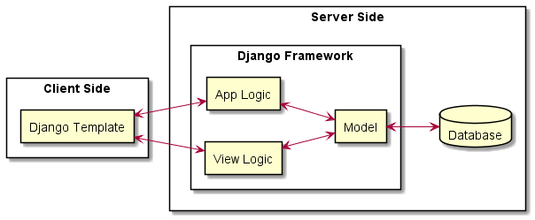
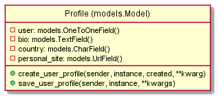
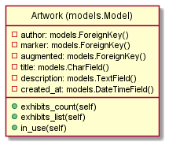
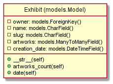

# Revision History
 
|Version | description| Author(s) | date |
|--------|------------|-----------|------|
|1.0|Initial version|Victor Gomide & Emanuel Holanda|05/10/2020| 
|1.1|New diagrams in  PlantUml| VIctor Gomide & Emanuel Holanda |24/10/2020|

# Software Architecture Document (SAD)
## Introduction 

This document provides a complete architectural overview of the Jandig ARte project. In it, you’ll find the goals and constraints of architecture, the use-case view, the logical view, among others.

### Scope 

This document is extremely important for understanding the project as a whole, since architecture is the basis of all software. It is not only suitable for people who want to contribute to the project, but also so that the current team can remember and even change previous architectural decisions.

### Definitions, Acronyms, and Abbreviations

- **SAD:** Software Architecture Document
- **App:** Application
- **MTV:** Model-Template-View
- **PWA:** Progressive Web App

### References

 - [Jandig ARte's Wiki](https://github.com/memeLab/Jandig/wiki/Jandig-ARte-architecture)
 - [CSUN's Software Architecture Document Template](https://www.google.com/url?sa=t&rct=j&q=&esrc=s&source=web&cd=&cad=rja&uact=8&ved=2ahUKEwjX4638opzsAhXlHrkGHfRtDwkQFjALegQIARAC&url=https%3A%2F%2Fprojects.cecs.pdx.edu%2Fattachments%2Fdownload%2F3180%2FSoftware_Architecture_Document_SF.docx&usg=AOvVaw0aIZsfpWJeIJ52HMgh7nXx)
 - [Documento de Arquitetura de Software - Facom/UFU](https://www.google.com/url?sa=t&rct=j&q=&esrc=s&source=web&cd=&ved=2ahUKEwi9m7T2rpzsAhVuF7kGHVbrBYwQFjACegQIARAC&url=http%3A%2F%2Fwww.facom.ufu.br%2F~flavio%2Fpds1%2Ffiles%2F2016-01%2Frup_sad-template-documento-arquitetura.dot&usg=AOvVaw3qyZZysozErnD64wCX-vOy)
 - [Documento de Arquitetura de Software RDI-AEE](https://www.google.com/url?sa=t&rct=j&q=&esrc=s&source=web&cd=&cad=rja&uact=8&ved=2ahUKEwiE78LEr5zsAhV7GLkGHSWyAVMQFjAAegQIBRAC&url=http%3A%2F%2Frepositorio.aee.edu.br%2Fbitstream%2Faee%2F1106%2F3%2FTCC2_2018_2_GabrielLeiteDias_MatheusLimadeAlbuquerque_Apendice2.pdf&usg=AOvVaw2wXEOkYpBHmN32ChHHDgOh)
- [The Django Book: Django's Structure](https://djangobook.com/mdj2-django-structure/)

### Overview

In order to explain Jandig ARte's architecture from different points of views, here's an approach of the next topics:

- **Architectural Representation:** architecture of the software as a whole.
- **Architectural Goals and Constraints:** non-functional requirements we want to achieve through Jandig.
- **Use-Case View:** expected behavior from users of Jandig's functionalities.
- **Logical View:** the internal organization of code, its packages, layers and classes.

## Architectural Representation

Project's main programming language is Python, through Django framework. Django uses an exclusive architecture called **MTV (Model-Template-View)**, in which **Model** represents the data layer, **Template** represents user's interface and **View** acts as an intermediary layer between them:

Jandig ARte is a **Progressive Web App (PWA)**, which means it is an web app that has a similar use to a native mobile app. It uses **PostgreSQL** as database.

## Architectural Goals and Constraints

Jandig was created for providing a low-cost and easy-to-use augmented reality experience to artists and art contemplators. That said, the software must be:

- Easy to learn, use and memorize;
- Usable through a smartphone, allowing more people to use it;
- No previous knowledge of programming necessary for using it;
- Free, or cheap enough;
- Available in different languages, so people around the world can use it;
- Open Source, so community can work together for making it awesome!

## Use-Case View
### Account Access and Management

The diagram below shows how account access and management is done, with users and system as actors. Please note that Visitor is an user that hasn't log in the app.

### Artist Role

The following diagram shows the application's features focused on the Artist's role.

### Other Features

Below are shown some other interesting features from Jandig ARte:

## Logical View
### Overview

Since the software is Django-based, it contains projects, apps and layers. in Jandig ARte case, we have two main apps: "core" and "users".
 
    
 
 
### Architecturally Significant Design Packages

#### "Profile" Class Diagram

#### "Marker" Class Diagram

#### "Artwork" Class Diagram

#### "Object" Class Diagram

#### "Exhibit" Class Diagram

